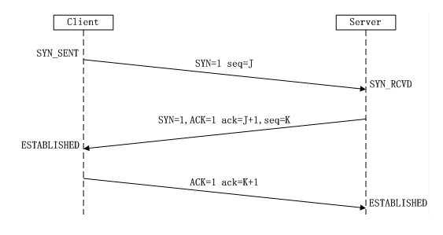
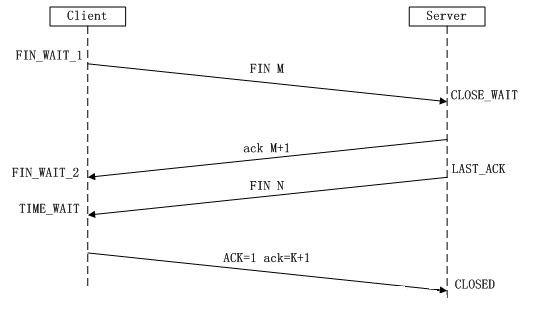
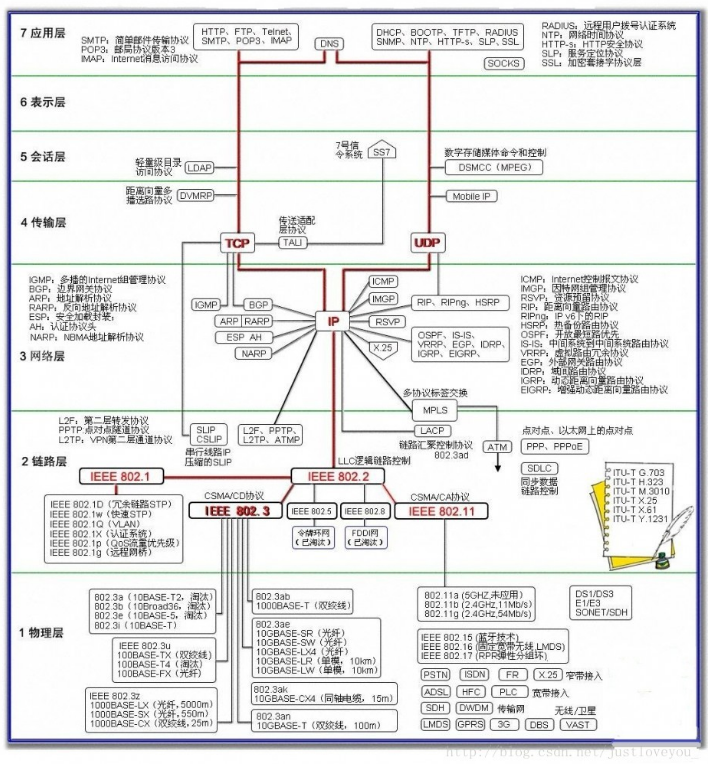

# For Interview

### 网络

1. Http和Https

   * http协议运行在TCP之上,明文传输,客户端与服务器都无法验证对方身份
   * https运行于SSL(Secure Socket Layer)之上,SSL运行与TCP之上,添加了加密和认证机制
   * 端口不同: http: 80 https: 443
   * 资源消耗不同 : Https通信会由于加减密处理消耗更多的CPU和内存资源
   * 开销: https通信需要整数,而证书一般需要向认证机构购买;

   Https的加密机制是一种共享秘钥加密和公开秘钥加密并用的混合加密机制.

2. 对称加密与非对称加密

3. 三次握手与四次挥手

   两个序号和三个标志位

   1. seq序号,32位,表示TCP源端向目的地端发送的字节流,发起方发送数据时对此进行标记

   2. ack确认序号,32位,只有ACK=1时,确认序号才有效,ack=seq+1

   3. 标志位

      URG	紧急指针有效

      ACK		确认序号有效

      PSH		接收方应尽快将这个报文交给应用层

      RST		重置连接

      SYN		发起一个新连接

      FIN		释放一个连接

   3次握手

   

   4次挥手

   

4. 从输入网址到获得页面的过程

   1.浏览器查询DNS,获取域名对应IP(域名解析)

   2.浏览器获得域名IP后,向服务器请求建立连接,三次握手

   3.TCP/IP连接建立后,浏览器向服务器发送HTTP请求

   4.服务器收到请求,并根据路径参数映射到特定的请求处理器进行处理,并将结果及对应的视图返回给浏览器

   5.浏览器解析并渲染视图,若遇到对js文件,css文件及图片等静态资源的引用,重复上述步骤并向服务器请求这些资源

   6.浏览器根据请求到的资源,数据渲染页面

5. Session,Cookie与Application

   cookie: 客户端保持状态

   session: 服务器端保持状态

   Application: 与一个Web应用程序相对应,为应用程序提供了一个全局的状态,所有客户都可以使用该状态

6. ARP协议

   **完成了IP地址与物理地址的映射**

   地址解析协议(Address Resolution Protocol), 其基本功能为透过目标设备的IP地址,查询目标的MAC,以保证通讯的进行.在IPv6中被(NDP)替代

7. TCP 粘包

   TCP粘包是指发送方发送的若干数据到接收方时粘成一包,从接收缓冲区看,后一包数据的头紧接着前一包数据的尾.

   发生主要是因为socket缓冲区导致的.

   你的程序实际上无权直接操作网卡的，你操作网卡都是通过操作系统给用户程序暴露出来的接口，那**每次你的程序要给远程发数据时，其实是先把数据从用户态copy到内核态**，这样的操作是耗资源和时间的，频繁的在内核态和用户态之前交换数据势必会导致发送效率降低， **因此socket 为提高传输效率，发送方往往要收集到足够多的数据后才发送一次数据给对方**。若连续几次需要send的数据都很少，通常TCP socket 会根据优化算法把这些数据合成一个TCP段后一次发送出去，这样接收方就收到了粘包数据。

   **两种情况下会发生粘包：**

   1. 发送端需要等缓冲区满才发送出去，造成粘包（发送数据时间间隔很短，数据了很小，会合到一起，产生粘包）
   2. 接收方不及时接收缓冲区的包，造成多个包接收（客户端发送了一段数据，服务端只收了一小部分，服务端下次再收的时候还是从缓冲区拿上次遗留的数据，产生粘包）

   **解决方案**:

   为字节流加上自定义固定长度报头，报头中包含字节流长度，然后一次send到对端，对端在接收时，先从缓存中取出定长的报头，然后再取真实数据.(python可借助第三方模块struct).

8. SQL注入

   SQL注入就是通过把SQL命令插入到Web表单提交或输入域名或页面请求的查询字符串,最终达到欺骗服务器执行恶意的SQL命令.

   **应对方案**

   使用预编译手段,绑定参数是最好的防SQL注入的方法.

   使用正则表达式过滤传入的参数

9. XSS攻击

   XSS是指恶意攻击者利用网站没有对用户提交数据进行转义处理或者过滤不足的缺点,进而**添加一些脚本代码嵌入到web页面**中去,使别的用户访问都会执行相应的嵌入代码.

   主要原因: 过于新人客户端提交的数据

   解决方式: 

   1. 过滤特殊字符

   2. 使用HTTP头指定类型

      ```java
      w.Header().Set("Content-Type", "text/javascript")
      ```

      这样就可以让浏览器解析javascript代码,而不会是html输出

10. DDoS

    DDoS:分布式拒绝服务攻击(Distribution Denial of Service),简单得说就是发送大量请求是服务器瘫痪

    SYN攻击

    SYN攻击是指,攻击客户端在短时间内**伪造大量不存在的IP地址**,向服务器不断地发送SYN包,服务器回复确认包,并等待客户的确认(等待ack).由于原地址是不存在的,服务器需要不断重发直到超时,这些伪造的SYN包将长时间占用未连接队列,正常的SYN请求被丢弃,导致目标系统运行缓慢.

    预防:

    DDoS防御产品的核心是检测技术和清洗技术.

    检测技术: 检测网站是否正在遭受DDoS攻击

    清洗技术: 清洗掉异常流量

11. CSRF

    CSRF(Cross-site request forgery),跨站请求伪造: 攻击者盗用你的身份,以你的名义发送恶意请求.

    **原理**

12. ICMP

    

13. OSI

    

    

### 操作系统

1. 进程间的通信通讯方式

   * 管道(pipe)及命名管道(named pipe)
   * 信号(signal)
   * 消息队列
   * 共享内存
   * 信号量
   * 套接字

2. 线程同步的方式

   * 互斥量Synchronized/Lock
   * 信号量Semphare
   * 事件(信号),Wait/Notify

3. 死锁产生的四个必要条件

   * 互斥
   * 占有并等待
   * 非抢占
   * 循环等待

4. 进程状态

   * 就绪状态: 进程已获得处理机意外的所需资源,等待分配处理机资源
   * 运行状态: 占用处理机资源运行,处于专题太的进程数小于等于CPU数
   * 阻塞状态: 进程等待某种条件,在条件满足之前无法执行

5. 线程的状态

   * 新建状态(NEW)
   * 就绪状态(RUNNABLE)
   * 运行状态(RUNNING)
   * 阻塞状态(BLOCKED)
   * 死亡状态(DEAD)

6. 分页和分段

   1.段式

   * 是一种符合用户视角的内存分配管理方案

   * 段式存储管理中,将程序的地址空间划分为若干段(segment),如代码段,数据段,堆栈段;
   * 段的大小不固定,由其所完成的功能决定
   * 段向用户提供二维地址空间

   * 没有内碎片,但是换入换出时,会产生外碎片
   * 段是信息的逻辑单位,便于存储保护和信息的共享

   2.页式

   * 是一种用户视角内存与物理内存相分离的内存分配管理方案
   * 在页式存储管理中,将程序的逻辑地址划分为固定大小的页(page),而无力内存划分为同样大小的帧
   * 页的大小由系统决定
   * 页向用户提供的是一维地址空间
   * 没有外碎片,但是会产生内碎片
   * 页的保护和共享受到限制

7. 操作系统中进程调优策略

   * FCFS(先来先服务,队列实现,非抢占)
   * SJF(最短作业优先):平均等待时间最短,但难以知道下一个CPU区间长度
   * 优先级调度算法(抢占或非抢占):
   * 时间片轮转你调度算法(可抢占):
   * 多级队列调度算法
   * 多级反馈队列调度算法

8. 进程同步机制

   * 原子操作,信号量机制,自旋锁,管程,会合,分布式系统

9. 虚拟内存

   基本思想: 每个进程拥有独立的地址空间,这个空间被分为大小相等的块,称为页(Page),每个页都是一段连续的地址.

   这些页被映射到物理内存，但并不是所有的页都必须在内存中才能运行程序。当程序引用到一部分在物理内存中的地址空间时，由硬件立刻进行必要的映射；当程序引用到一部分不在物理内存中的地址空间时，由操作系统负责将缺失的部分装入物理内存并重新执行失败的命令。

   **对于进程而言，逻辑上似乎有很大的内存空间，实际上其中一部分对应物理内存上的一块(称为帧，通常页和帧大小相等)，还有一些没加载在内存中的对应在硬盘上**

10. 页面置换算法

    * FIFO(先进先出算法)
    * LRU(Least recently use)最近最少使用算法
    * LFU(Least frequently use)最少使用次数算法
    * OPT(Optimal replacement)最优置换算法

11. 虚拟内存的应用与优点

    虚拟内存很适合在多道程序设计系统中使用,许多程序的片段同时保存在内存中.当一个程序等待它的一部分读入内存时,可以把CPU交给另一个进程使用.虚拟内存的使用可以带来以下好处:

    * 在内存中可以保留多个进程,系统并发度高
    * 解除了用户与内存之间的紧密约束,进程可以比内存的全部空间还大.

12. 

### 数据库

1. 数据库**范式**

   * 第一范式: 列不可分
   * 第二范式: 有主键, 保证完全依赖
   * 第三范式: 无传递依赖

2. 数据库**索引**

   **索引是对数据库表中一个或多个列的值进行排序的数据结构,以协助快速查询,跟新数据库表中数据**

   索引加速了数据访问,因为存储引擎不会再去扫描整张表得到需要的数据;相反它从根节点开始,根节点保存了子节点的指针,存储引擎会根据指针快速寻找数据.

3. **B-Tree(平衡多路二叉树)**

4. **事务**

   事务(Transaction),一般是指要做的或所做的事情.在计算机术语中是指访问并可能更新数据苦衷各种数据项的一个程序执行单元(unit).在计算机术语中,事务通常就是指数据库事务.

   存在目的:

   * 为数据库操作提供了一个从失败到回复到正常的方法,同时提供了数据库即使在异常状态下仍能保持一致的方法.
   * 当多个应用程序在并发访问数据库时,可以在这些程序之间提供一个隔离方法,以防止彼此的操作互相干扰

   当一个事务被提交给了DBMS（数据库管理系统），则DBMS需要确保该事务中的所有操作都成功完成且其结果被永久保存在数据库中，如果事务中有的操作没有成功完成，则事务中的所有操作都需要被回滚，回到事务执行前的状态（要么全执行，要么全都不执行）;同时，该事务对数据库或者其他事务的执行无影响，所有的事务都好像在独立的运行。

   特性:

    * 原子性(Atomicity): 事务作为一个整体被执行,包含在其中的对数据库的操作要么全部被执行,要么都不执行.
   * 一致性(Consistency): 事务应确保数据库的状态从一个一致状态变为另一个一致状态.一致状态的含义是数据库中的数据应满足完整性约束.
   * 隔离性(Isolation): 多个事务并发执行时,一个事物的执行不影响其他事务的执行
   * 持久性(Durability): 一个事务一旦提交,他对数据库的修改应该永久保存在数据库中

5. **乐观锁和悲观锁**

   悲观锁: 假定会发生并发冲突, 屏蔽掉一切可能违反数据完整性的操作

   乐观锁: 假设不会发生并发冲突,只在提交操作时检查是否违反数据完整性

6. 

### 数据结构

### python

#### 高并发

https://www.cnblogs.com/JackLi07/p/9227095.html

##### 同步/异步and阻塞/非阻塞

同步: 在发出一个功能调用时,在没有得到结果之前,该调用就不会返回.

异步: 当一个异步功能调用发出后,调用者不能立即得到结果,当该异步功能完成后,通过状态,通知或回调来通知调用者.

阻塞: 是指调用结果返回之前,当前线程会被挂起.函数只有在得到结果后才会将阻塞的线程激活.

非阻塞: 指在不能立即得到结果之前也会立即返回,同时该函数不会阻塞当前线程

同步异步针对的是**函数/任务**的调用方式:

阻塞与非阻塞针对的是**进程或线程**

##### 生产者消费者模型

生产者指的是生产数据的任务,消费者指的是处理数据的任务,在并发编程中,如果生产者和消费者的处理能力不平衡,就会出现一方等待另一方处理完成的情况

生产者消费者模式通过一个容器来解决生产者和消费者的强耦合问题.生产社和消费者不直接通讯,而是通过阻塞队列来进行通讯,生产者生产数据后直接给阻塞队列,消费者从阻塞队列中读取,**阻塞队列就相当于一个缓冲去,平衡了生产者和消费者的处理能力.**

https://github.com/QAlexBall/Python_Module/tree/master/Concurrency/Concurrency1


#### python中list的实现

List对象的C结构

```c
typedef struct {
    PyObject_VAR_HEAD
    PyObject **ob_item;  // ob_item用来保存元素的指针数组
    Py_ssize_t allocated;// allocated是ob_item预先分配的内存总容量
} PyListObject;
```

##### python import
import
1. 找到指定的模块,必要时载入并初始化
2. 在import语句执行的地方为本地命名空间定义变量名

from ... import ...
1. 找到from从句中指定的模块,加载并初始化它
2. 对于跟在import后的每个标识符(名称):
    * 验证from从句加载的模块是否有这个名称的属性
    * 如果没有,尝试导入一个以这个名称为名字的子模块,然后再验证一下from从句中加载的模块是否有这个名称的属性
    * 如果from从句中加载的模块此时没有这个名称的属性,ImportError
    * 如果没有报错,本地命名空间会产生对标识符指向的对象的一个引用,如果有as从句,用as从句中的名称表示这个引用,如果没有as从句,用属性名即标识符表示这个引用.

模块搜索顺序
1. 包含输入脚本的目录
2. PYTHONPATH
3. 和安装有关的默认配置
4. 完成初始化后,Python程序可以修改sys.path变量.包含运行脚本的目录会被放到搜索路径的开头,比标准库路径还要靠前,这便意味着包含运行脚本的目录下的模块会屏蔽掉标准库里的标准模块. 

#### Flask
render_template()实现机制?
```python
# render_template()源码
def render_template(template_name_or_list, **context):
    """Renders a template from the template folder with the given
    context.

    :param template_name_or_list: the name of the template to be
                                  rendered, or an iterable with template names
                                  the first one existing will be rendered
    :param context: the variables that should be available in the
                    context of the template.
    """
    ctx = _app_ctx_stack.top
    ctx.app.update_template_context(context) # 使用一些常用变量跟新模板上下文
    return _render(ctx.app.jinja_env.get_or_select_template(template_name_or_list),
                   context, ctx.app)
```
当我们向render_template传入模板,和变量的跟新模板上下文后,render_template调用了ctx.app.jinjia_env.get_or_select_template.该方法属于jinjia2模块中的Enviroment,通过调用get_template,或select_template方法返回template的名字或列表,最后get_or_select_template调用_render方法.
```python
# render
def _render(template, context, app):
    """Renders the template and fires the signal"""

    before_render_template.send(app, template=template, context=context)
    rv = template.render(context)
    template_rendered.send(app, template=template, context=context)
    return rv
```
render() will return template as unicode string.

### C++11

### Linux

* ps 用来查看当前运行程序状态

* ​         -A 显示所有进程

  ​         a 显示所有进程

  ​         -a 显示同一终端下所有进程

  ​         c 显示进程真实名称

  ​         e 显示环境变量

  ​         f 显示进程间的关系

  ​         r 显示当前终端运行的进程

  ​         -aux 显示所有包含其它使用的进程

系统信息

* arch: 显示机器的处理架构
* uname -r 显示正在使用的内核版本
* sudo dmidecode -q: 显示硬件系统部件
* cat /proc/cpuinfo 显示cpu info的信息
* lspci -tv 罗列PCI设备
* lsusb -tv 显示usb设备

文件和目录

* ln -s file1 link1 穿件一个指向文件或目录的软连接
* ln file1 link1 创建一个文件或目录的物理连接
* iconv -l 列出已知的编码

文件搜索

* find / -name file1 从'/'开始进入根文件系统搜索文件和目录
* whereis halt 显示一个二进制文件,源码或man的位置
* which halt 显示一个二进制文件或可执行文件的完整路径

挂载一个文件系统

* mount /dev/hda2 /mnt/hda2 关在叫做hda2的盘 - 确定目录'/mnt/hda2'已经存在
* umount /dev/hda2 卸载一个叫做hda2的盘 - 先从挂载点'/mnt/hda2'退出
* 

网络

* ifconifg eth0 显示一个以太网卡的配置
* ifup eth0 启动一个'eth0'网络设置
* ifdown eth0 禁用一个'eth0'网络设置
* route -n 查看默认路由及网关
* route del default gw 10.6.2.1  删除默认网关
* route add default gw 10.6.2.110 配置默认网关
* arp 查看arp缓存
* arp -s IP MAC 添加arp记录(可伪造arp)

### 算法


### 其他

1. 软件开发基本流程

   * 可行性分析
   * 需求分析
   * 系统设计
   * 程序设计
   * 测试与调整
   * 系统维护

2. **软件测试模型：**

   传统：项目计划——需求分析——软件设计——程序开发——软件测试——集成维护 

   V模型：需求分析-概要设计-详细设计-软件编码-单元测试-集成测试-系统测试-验收测试
   W模型：用户需求-需求分析-概要设计-详细设计-编码-单元测试-集成测试-验收测试-单元测试设计-集成测试设计-系统测试设计-验收测试设计-集成-实施-交付
   X模型：程序片段1-测试设计-工具配置-执行测试-编码完成-执行测试-工具配置-测试设计-程序片段N；封版-执行测试-测试设计-工具配置-迭代1...N-探索式测试-执行测试
   H模型：测试准备-测试就绪点-测试执行-测试流程-其他流程

3. 


